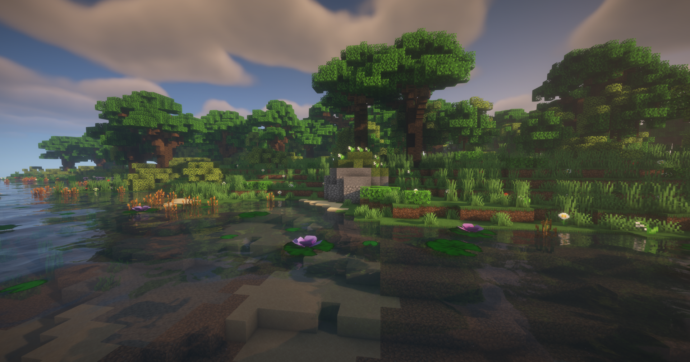
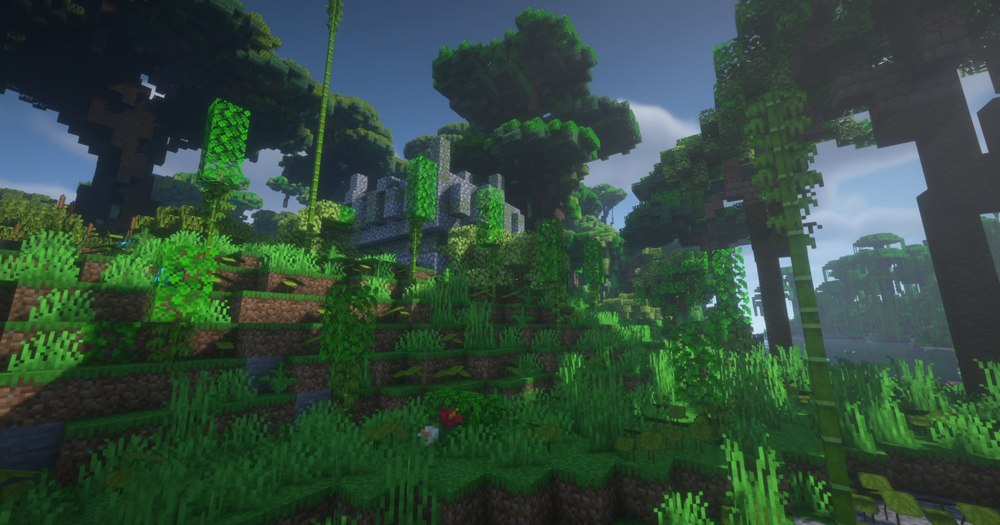
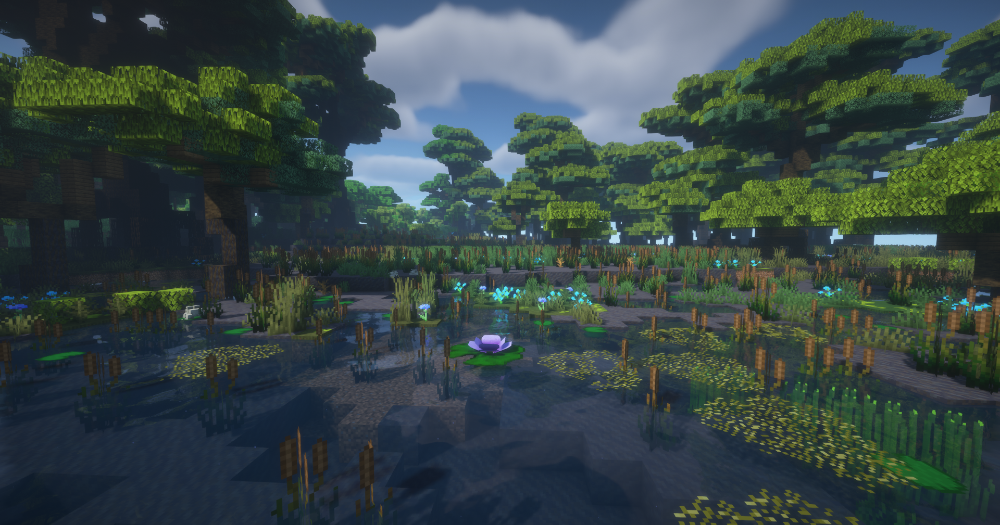
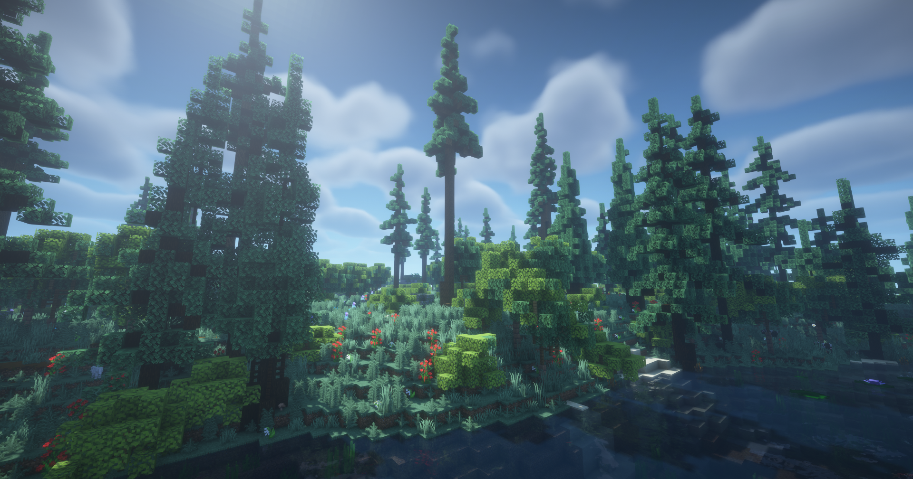

<p align="left" style="display: flex; gap: 16px; align-items: center;">
	
	
</p>

# Eido-Flora
## Description
### English
Eido-Flora is part of the Eido project, formerly known as the '4' project. Its goal is to replace vanilla vegetation with custom plants to enhance Minecraft's flora. It is compatible with most terrain-generation mods.

### Français
Eido-Flora fait partie du projet Eido, anciennement appelé projet '4'. Son objectif est de remplacer la végétation vanilla par des plantes personnalisées afin d’enrichir la flore de Minecraft. Il est compatible avec la plupart des mods de génération de terrain.

## Acknowledgements
### English
I would like to thank the authors of the following mods:
- [hybrid-aquatic](https://github.com/hybridlabs/hybrid-aquatic/tree/1.21.1-multiloader), from which I reused some algae textures

### Français
Je remercie les auteurs des mods suivants :
- [hybrid-aquatic](https://github.com/hybridlabs/hybrid-aquatic/tree/1.21.1-multiloader), dont j’ai repris certaines textures d’algues

## Advertisement
### English
As mentioned above, Eido-Flora is part of the Eido project mod collection. If you are interested in following the development of the Eido meta-project, feel free to join our server.

### Français
Comme indiqué plus haut, Eido-Flora fait partie de la collection de mods du projet Eido. Si vous êtes intéressé par le suivi du développement du méta-projet Eido, je vous invite à rejoindre notre serveur.

### Media
Still with the old name,
- WebSite : https://mc.berryblue.fr/
- Discord : https://discord.gg/brwbTkNnTx

## Showcase

<table>
	<tr>
		<td align="center">
			
		</td>
		<td align="center">
			
		</td>
	</tr>
	<tr>
		<td align="center">
			
		</td>
		<td align="center">
			
		</td>
	</tr>
</table>

## Project Structure

This project focuses on a Minecraft mod. Below is a focused tree for `src/main` (Java sources and resources) with short descriptions of the important files and folders.

```
src/main
├─ java/
│  └─ fr/Eidolyth/
│     ├─ Config.java                       	# Mod configuration helper
│     ├─ EidoPlants.java                    # Mod common entry point / setup
│     ├─ EidoPlantsClient.java              # Client-only setup (renderers, client events)
│     ├─ ModBlocks.java                     # Block registrations
│     ├─ ModItems.java                      # Item registrations
│     ├─ ModCreativeModTabs.java            # Creative tab(s) registration
│     ├─ ModFeatures.java                   # Feature registration (worldgen features)
│     ├─ worldgen/
│     │  ├─ ModWorldGen.java                # World generation wiring
│     │  ├─ NbtTreeFeature.java             # NBT-based structure feature
│     │  └─ NbtTreeFeatureConfig.java       # Config for NBT tree feature
│     ├─ agriculture/
│     │  ├─ BonemealNerf.java               # Tweaks to bonemeal behavior
│     │  └─ GrowthTweaks.java               # Plant growth adjustments
│     ├─ block/
│     │  └─ VoxelBlock.java                 # Custom voxel block base
│     └─ item/
│        ├─ WateringPotItem.java            # Item for watering plants
│        ├─ BiomColoredBlockItem.java       # Colored block item variant
│        └─ BiomColoredPlaceOnWaterBlockItem.java
├─ resources/
│  ├─ assets/eidoplants/
│  │  ├─ blockstates/                       # blockstate jsons
│  │  ├─ models/                            # item/block model jsons
│  │  ├─ textures/                          # textures for blocks and items
│  ├─ data/eidoplants/
│  │  ├─ worldgen/                          # datapack worldgen registries and configs
│  │  ├─ structures/                        # .nbt structure files used by NbtTreeFeature
│  │  ├─ recipes/                           # custom recipes (plants/)
│  │  ├─ tags/                              # tag definitions (blocks/items/worldgen)
│  │  └─ neoforge/                          # loader-specific datapack files (biome modifiers etc.)
│  └─ META-INF/
│     └─ neoforge.mods.toml                 # mod metadata for Neoforge loader
```

If you want, I can expand any of the subfolders above into a full file list (for example, list every file under `assets/eidoplants/blockstates/` or every class in `fr.Eidolyth`).

## Contribution
1. Create a dedicated branch for each new feature or bug fix.
2. Commit your changes with clear and detailed messages.
3. Make sure to follow the project's [Git syntax](doc/gitSyntax.md).
4. Submit a pull request for review by another team member.

## Authors
- Samuel Chapuis (Thorid4n) — Project Lead

## Acknowledgments
This section recognizes the main contributors to the project and their roles.

- Avixy — Developer
- Fabrice Lozac'h (Fab0uu) — Network Developer

## License
This project is licensed under the MIT License.
You are free to use, modify, and distribute this software with proper attribution.

See [LICENSE](LICENSE) for details.